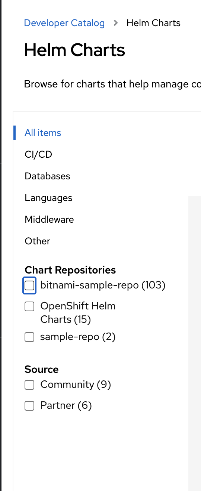

# Namespace-scoped Helm Repository CRD

## Release Signoff Checklist

- [x] Enhancement is `implementable`
- [ ] Design details are appropriately documented from clear requirements
- [ ] Test plan is defined
- [ ] Operational readiness criteria is defined
- [ ] Graduation criteria for dev preview, tech preview, GA
- [ ] User-facing documentation is created in [openshift-docs](https://github.com/openshift/openshift-docs/)

## Summary

Right now we support [`cluster-scoped` Helm repository CRD](https://github.com/openshift/api/blob/master/helm/v1beta1/0000_10-helm-chart-repository.crd.yaml#L17). This requires admin-level permissions when developers want to add a Helm repository in the OpenShift Console. We would like to add the ability to install Helm repository as a custom resource but with `scope: namespaced`.


## Motivation

While the current cluster-scoped CRD for Helm repository provides ability for admins to add Helm repositories as custom resources, regular users/developers need an admin's permission in order to add Helm repositories of their choice. In order to further increase the customizability of Helm within OpenShift, a new namespace-scoped CRD for Helm repositories is needed.

### Goals

- New namespace-scoped CRD created for Helm repositories: ProjectHelmChartRepository
- Able to create the new namespace-scoped custom resource, ProjectHelmChartRepository
- Document in helm section describing the difference between ProjectHelmChartRepository and HelmChartRepository

### Non-Goals

- Change the existing cluster-scoped CRD, HelmChartRepository

## Proposal

### User Stories

#### Story 1

As an OpenShift developer, I would like to be able to add Helm repositories within my project without asking for an administrator's permissions

### API Extensions

A new namespace-scoped CRD is introduced and no [cluster role aggregation](https://kubernetes.io/docs/reference/access-authn-authz/rbac/#aggregated-clusterroles) is added as part of this enhancement.

#### Introducing a new namespace-scoped custom resource, ProjectHelmChartRepository

Example definition:
```yaml
apiVersion: helm.openshift.io/v1beta1
kind: ProjectHelmChartRepository
metadata:
  name: my-enterprise-chart-repo
spec:
  url: https://my.chart-repo.org/stable

  # optional and only needed for UI purposes
  displayName: myChartRepo

  # optional and only needed for UI purposes
  description: my private chart repo
```

To add a new namespace-scoped Helm repository to a desired namespace:
```shell
$ cat <<EOF | oc apply --namespace my-namespace -f -
apiVersion: helm.openshift.io/v1beta1
kind: ProjectHelmChartRepository
metadata:
  name: stable
spec:
  url: https://kubernetes-charts-incubator.storage.googleapis.com
  displayName: Public Helm stable charts
  description: Public Helm stable charts hosted on HelmHub
EOF

$ kubectl get projecthelmchartrepositories --namespace my-namespace
NAME          AGE
stable        1m
```

The addition of namespace-scoped Helm repository does not impact behavior of the existing cluster-scoped Helm repository:

```shell
$ cat <<EOF | oc apply -f -
apiVersion: helm.openshift.io/v1beta1
kind: HelmChartRepository
metadata:
  name: stable
spec:
  url: https://kubernetes-charts.storage.googleapis.com
  displayName: Public Helm stable charts
  description: Public Helm stable charts hosted on HelmHub
EOF

$ cat <<EOF | oc apply --namespace my-namespace -f -
apiVersion: helm.openshift.io/v1beta1
kind: ProjectHelmChartRepository
metadata:
  name: incubator
spec:
  url: https://kubernetes-charts-incubator.storage.googleapis.com
  displayName: Public Helm charts in incubator state
EOF

$ kubectl get helmchartrepositories
NAME          AGE
cluster       3h30m
stable        1m

$ kubectl get projecthelmchartrepositories --namespace my-namespace
NAME          AGE
incubator     1m
```

#### How would the UI render the namespace-scoped Helm repository

As defined in [previous helm enhancement](https://github.com/openshift/enhancements/blob/master/enhancements/helm3/console.md#how-would-the-ui-discover-the-charts), the UI will invoke the `/api/helm/charts/index.yaml` endpoint and the endpoint will proxy requests to the configured chart repositories.
Enabling namespace-scoped Helm repository requires a new URL parameter `namespace` that specifies the namespace that contains the requested CRD.

Then the chart repository proxy will use all configured chart repositories, including cluster-scoped and available namespace-scoped Helm repositories in the requested namespace, and deliver to the UI an aggregated index file. The UI then renders the developer catalog with the aggregated index file.

### Implementation Details

[ODC-5713](https://issues.redhat.com/browse/ODC-5713): In the OpenShift Dev Console, add capabilities that allow developers to create Helm chart registries which are namespace scoped, to enable developers to pull in their own Helm charts to their namespace.



[HELM-244](https://issues.redhat.com/browse/HELM-244): Extend the `/api/helm/charts/index.yaml` API endpoint in OpenShift Dev Console backend to support query parameter `namespace`. For example, a GET request to `/api/helm/charts/index.yaml?namespace=foo` will respond an aggregated `index.yaml` file with entities extracted from both cluster scoped Helm repository and Helm repositories in `foo` namespace.

### Risks and Mitigations

N/A

## Design Details

N/A

### Test Plan

N/A

### Graduation Criteria

N/A

#### Dev Preview -> Tech Preview

N/A

#### Tech Preview -> GA

N/A

#### Removing a deprecated feature

N/A

### Upgrade / Downgrade Strategy

Upon downgrade, the namespace scoped Helm repository instances will not be deleted but the namespaced Helm repository CRD will be removed and OpenShift Dev Console will not consume/render the instances.

### Version Skew Strategy

N/A

### Operational Aspects of API Extensions

N/A

#### Failure Modes

N/A

#### Support Procedures

N/A

## Implementation History

N/A

## Drawbacks

N/A

## Alternatives

N/A
